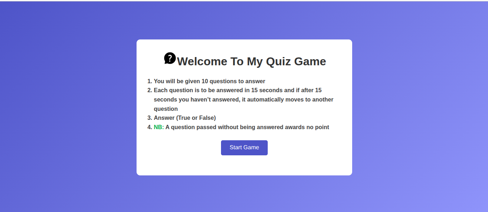
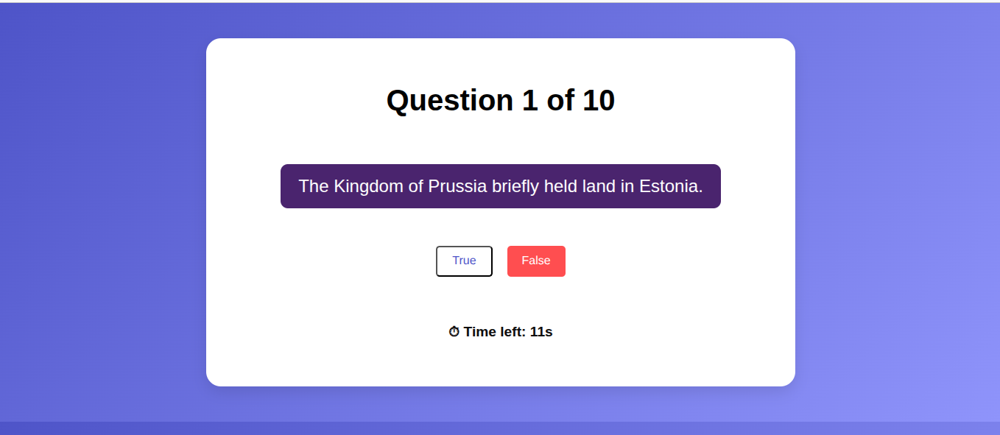
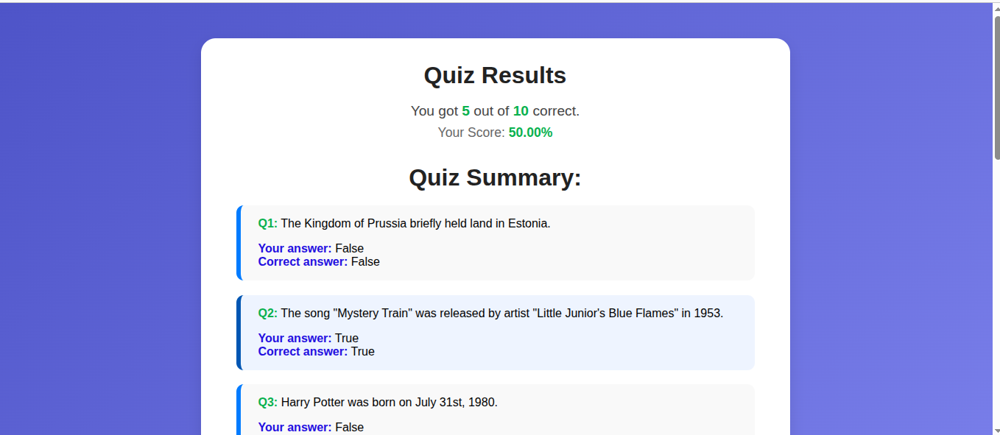
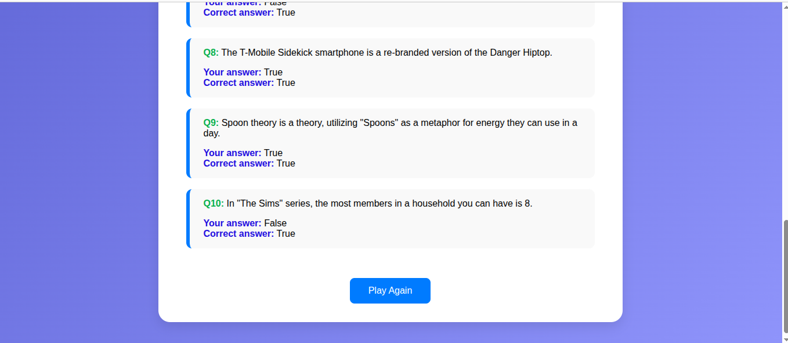

Project Name: Quiz Game App

Project View:

Project Description:
This Quiz Game App is a web interactive application that allows users to test their knowledge with multiple-choice questions.It pprovides engaging and fun experience with timer, real time scoring and result tracking.

#About 
-You will be given 10 questions to answer
-Each question is to be answered in 15 seconds and if after 15 seconds you haven’t answered, it automatically moves to another question
-Answer (True or False)
-NB: A question passed without being answered awards no point

Project Technical:
#Build With
-HTML
-CSS
-Javascript
-React.js (context API, localstorage)

#Features
- Multiple Choice Question
- Timer Countdown
- Score Calculation

Installation 
Clone the repository:

#Command Line
git clone
https://github.com/ndang11/quiz-app.git

cd quiz-app

npm install
npm start

How to Play:
-Click on the Start Game button on the landing page
-Answer all question before the timer runs out.
-Submit your answers to view your score and performance summary.
-Replay any time 

Link to my demo site:
[Link]()

Authors Details

Author: NDANG-KAH A [Frontend Developer]

GitHub: @ndang11
LinkedIn: @ndang-ambei
